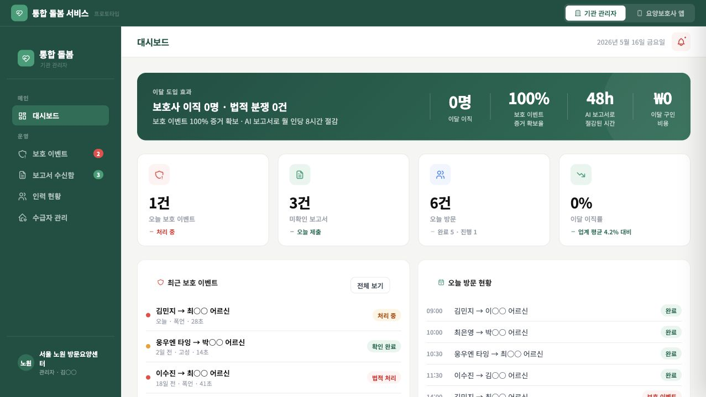
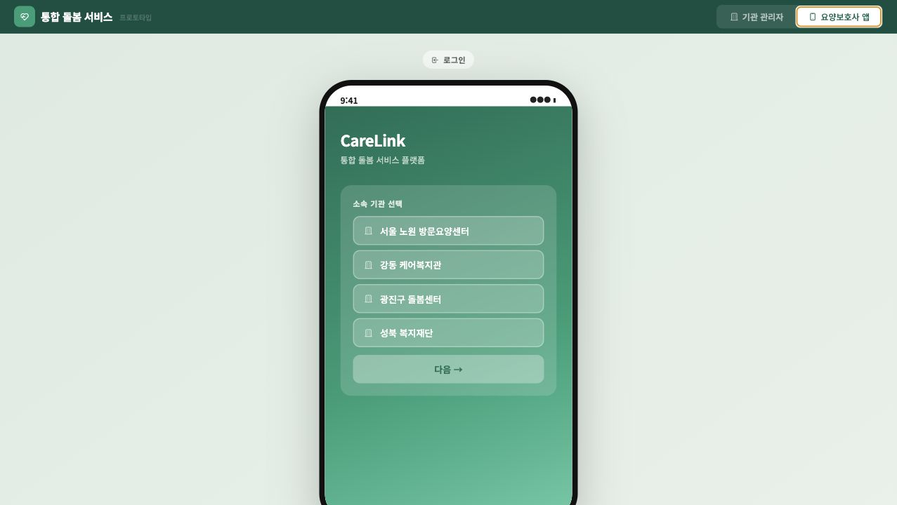
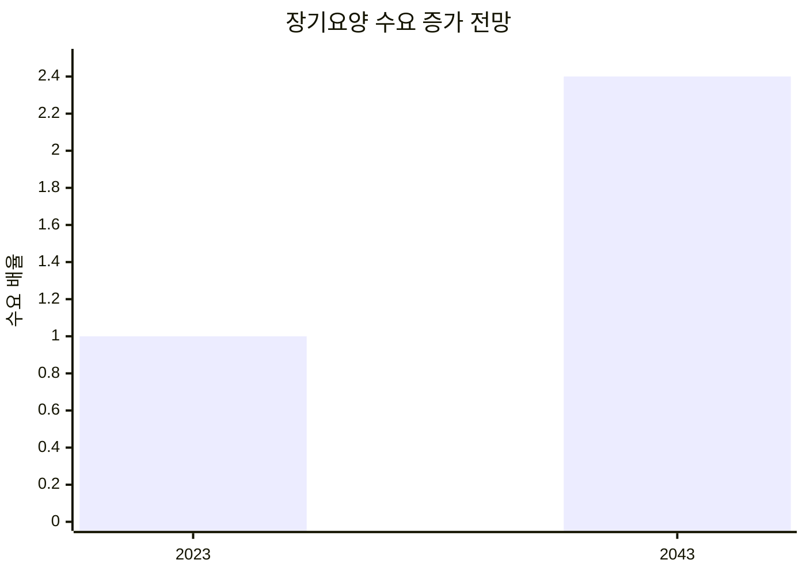
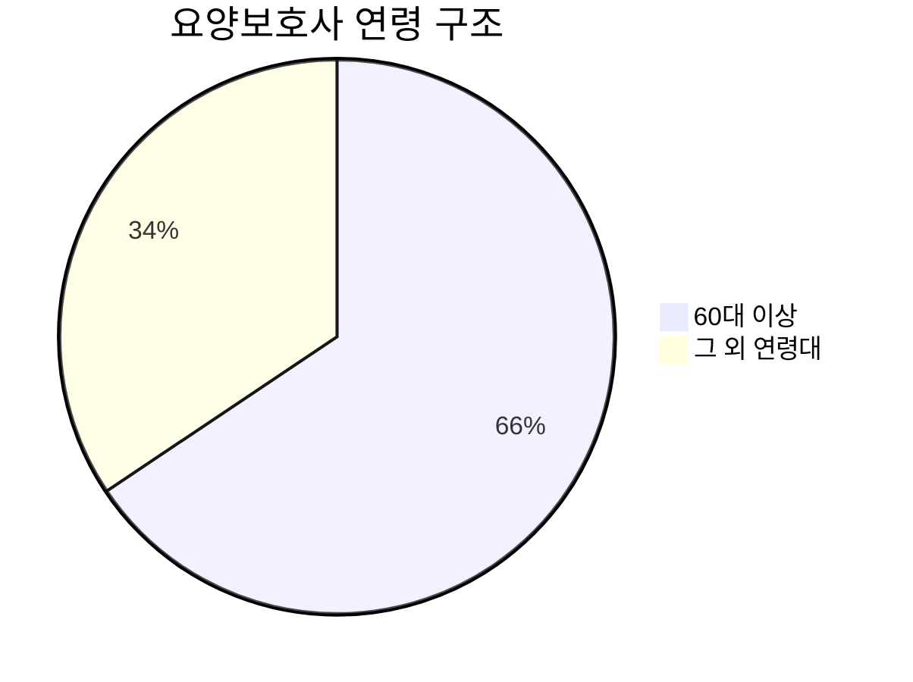
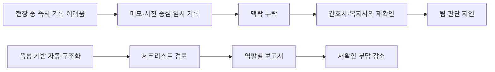
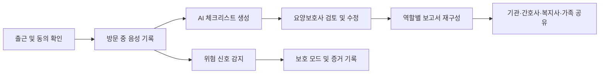
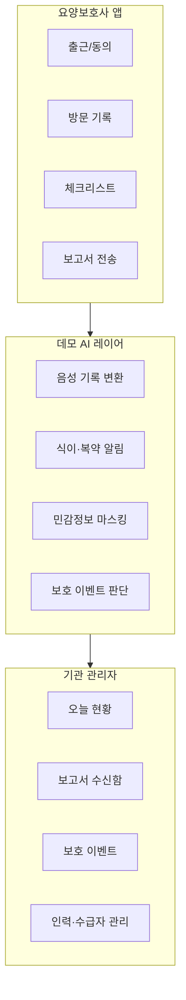

# 온기록 On-record

요양보호사가 행정 기록에 묶이지 않고 돌봄에 집중할 수 있도록 돕는 방문돌봄 기록 보조 프로토타입입니다.

현장 음성, 일정, 보호 이벤트를 바탕으로 돌봄 일지를 구조화하고, 기관 관리자·간호사·복지사·가족에게 필요한 형태로 보고서를 재구성하는 흐름을 데모합니다.

Production: https://idea-black-two.vercel.app

## Prototype

| 기관 관리자 화면 | 요양보호사 앱 |
| --- | --- |
|  |  |

## Why

방문돌봄 현장에서는 두 손과 시선이 항상 어르신에게 향합니다. 하지만 식사량, 정서 변화, 복약, 위험 상황은 팀 전체가 공유해야 하는 중요한 정보입니다.

온기록은 “두 손은 어르신께, 기록은 AI가”라는 방향으로 설계했습니다. 동의된 근무 시간 안에서 돌봄에 필요한 정보만 정리하고, 불필요한 사생활 정보는 남기지 않는 기록 보조 도구를 목표로 합니다.

## Planning Signals

기획 자료에서 본 문제는 세 가지 흐름으로 정리됩니다. 장기요양 수요는 커지고, 현장 인력은 고령화되어 있으며, 기록은 여전히 근무 후 수기로 정리되는 경우가 많습니다.





온기록은 아래의 문제 관계를 줄이는 방향으로 설계했습니다.



위 관계도는 제품 기획을 위한 문제 구조입니다. 실제 상관관계 검증은 현장 데이터 수집 이후의 과제로 남겨둡니다.

## Key Flow



## Core Features

- 음성 기반 돌봄 기록 구조화
- 식사, 복약, 정서 변화, 서비스 제공 항목 체크리스트화
- 간호사·사회복지사·가족 등 수신자별 보고서 재구성
- 민감정보 마스킹과 전송 전 보호사 검토
- 폭언·충돌 상황 감지 시 보호 모드와 증거 기록 시뮬레이션
- 기관 관리자용 보고서·보호 이벤트 대시보드

## Notebook Extension

노트북 확장 섹션은 방문 중 발생한 내용을 하나의 기록 단위로 묶어 보여주는 데모 영역입니다. 요양보호사가 방문을 마친 뒤, 음성으로 남은 돌봄 내용을 체크리스트와 보고서로 확인하는 흐름을 중심에 둡니다.

확장 흐름은 다음 순서로 구성됩니다.

```text
방문 기록 → 체크리스트 검토 → 식이·복약·보호 이벤트 반영 → 수신자별 보고서 생성
```

현재 프로토타입에서는 실제 서버 저장 대신 `index.html` 안의 정적 데이터와 `voice/` 미디어 자산을 사용합니다. 발표 상황에서 기능의 의도를 보여주기 위한 구성입니다.

## Demo Data

기본 데이터는 방문돌봄 기관의 하루 운영을 기준으로 구성했습니다.

- 기관: 서울 노원 방문요양센터
- 요양보호사: 김민지, 이수진, 최은영 등
- 수급자: 이○○, 김○○, 최○○, 박○○
- 관리자 화면 데이터: 보호 이벤트, 방문 보고서, 인력 현황, 수급자 현황
- 요양보호사 앱 데이터: 오늘 일정, 대상자 브리핑, 방문 기록, 체크리스트, 맞춤 보고서

최근 확장으로 추가된 내용은 다음과 같습니다.

- 식이 안전 데모: 저염식, 당뇨 식이, 연하 주의, 견과 알레르기 규칙
- 복약 알림 데모: 방문 중 복약 시간 안내와 확인 상태 반영
- 보호 모드 데모: 폭언 패턴 감지, 바디캠 전환, 증거 영상 재생
- 보고서 확장: 식이 경고와 복약 확인 내용을 방문 보고서에 포함
- README 화면 자료: 관리자 대시보드와 요양보호사 앱 캡처 이미지

## Architecture



현재 구현은 정적 HTML 프로토타입입니다. 실제 백엔드, 인증, 저장소, 모델 호출은 연결하지 않았고 발표용 흐름과 인터랙션을 중심으로 구성했습니다.

## Project Structure

```text
.
├── index.html          # 화면, 스타일, 데모 데이터, 인터랙션
├── voice/              # 음성 안내 및 보호 이벤트 데모 자산
├── assets/readme/      # README 화면 캡처
├── vercel.json         # Vercel 정적 배포 설정
└── .github/            # 이슈, PR, 검증 워크플로우
```

기획 및 GUI 참고 문서는 로컬 `docs/`에 보관하며, 공개 저장소에는 포함하지 않습니다.

## Local Preview

```bash
python3 -m http.server 4173
```

```text
http://127.0.0.1:4173
```

## Deployment

GitHub `main` 브랜치가 Vercel에 연결되어 있습니다.

```bash
git pull origin main
git add .
git commit -m "Update prototype"
git push origin main
```

`main`에 push하면 Vercel production 배포가 자동으로 갱신됩니다.
